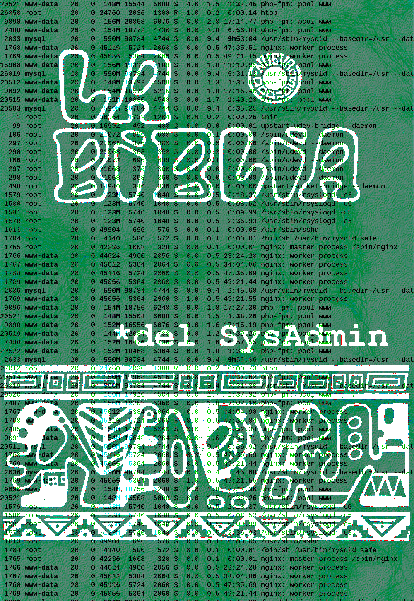

# La-Biblia-del-SysAdmin
*La Biblia del Sysadmin en español y en formato text/markdown.*

A lo largo de una serie de artículos voy a publicar los principios básicos que
todo SysAdmin debe respetar, practicar y predicar a sus pares. Estos
principios los he tomado (y orgullosamente puedo decir que he respetado casi
en su totalidad) del artículo [General SysAdmin Principles & Guidelines](http://rockhopper.monmouth.edu/cs/jchung/cs471/cs_471_-_general_sysadmin_principles)
publicado por el [Dr. Joe Chung](https://www.monmouth.edu/academics/CSSE/faculty/chung.asp).

Los Administradores de Sistemas, más conocidos como SysAdmins, somos a menudo
los superhéroes del departamento de sistemas, aquellos destinados a "salvar
el día" (muy a menudo, generalmente).

## Índice

* [Capítulo 1: Documentación](capitulo-01.md)
* [Capítulo 2: Lo difícil (seguridad y backups)](capitulo-02.md)
* [Capítulo 3: La eficiencia importa](capitulo-03.md)
* [Capítulo 4: Administración y acceso remoto](capitulo-04.md)

## Portada

