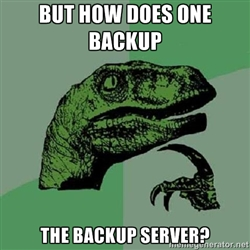

## Capítulo 2: Lo difícil (seguridad y backups)

Este segundo capítulo trata el tema más difícil en el trabajo de un SysAdmin:
seguridad y backups.

### Lo difícil (seguridad y backups)

* Ocuparse primero de lo más difícil.
    * Los mayores temores de todo SysAdmin son:
        * Que un sistema sea comprometido o su seguridad vulnerada ("hackeado").
        * Que información importante se pierda o borre y no exista una copia de
          seguridad (backup).
    Los [esquemas de backup](https://www.linuxito.com/gnu-linux/nivel-alto/564-como-crear-un-esquema-de-backup-simple-para-tu-vps),
    seguridad (hardening) y PRD (Plan de Recuperación ante Desastres) deben ser
    las primeras ocupaciones al momento de instalar/configurar un sistema o
    aplicación, y deben tener la mayor prioridad.
    * En ciertas empresas es necesario luchar a capa y espada (argumentos y
      justificaciones), todos los días, contra el mal <i>management</i> que sólo
      quiere que las cosas funcionen rápido y fácil, para luego "cuando haya
      tiempo" dedicarle un poco a la seguridad y backups.
    * Preguntarse a menudo ¿cuán bueno es nuestro esquema de backup?
        * ¿Existe hardware *spare* para reemplazar cada uno de los componentes
          de la infraestructura (dispositivos de energía, red, almacenamiento y
          servidores)?
        * En caso de utilizar tecnologías [cloud](https://www.linuxito.com/15-miscelaneo/642-curso-de-cloud-computing-online-gratuito-y-acreditado),
          ¿se provee backup de toda la infraestructura en la nube? Si el
          proveedor cloud provee mecanismos de backup ¿se ha efectuado un
          análisis detallado del mismo? y ¿es posible auditarlo? En caso de
          desastres de grandes magnitudes, ¿tenemos backups disponibles para
          replicar toda la infraestructura cloud en otro proveedor? Claramente
          la tecnología cloud requiere todo un capítulo aparte, ya que abre todo
          un abanico de nuevas posibilidades, y la importancia de las cuestiones
          de backup y seguridad aumenta considerablemente.
        * ¿Existe un plan y metodología para restaurar un sistema completo desde
          cero (incluyendo hardware y sistema operativo)?
        * ¿Se han hecho pruebas suficientes para verificar que la información
          almacenada en las copias de seguridad y el mecanismo de restauración
          funcionan de manera efectiva? En este punto es de vital importancia
          que el equipo de SysAdmins tenga lugar en su agenda para al menos un
          simulacro anual de recuperación ante desastres (PRD). Esta tarea debe
          ser la prioridad #1 en el plan de trabajo anual del equipo para
          mantener a los procedimientos actualizados y probados.
        * Recuperar la infraestructura el día del juicio final debe ser una
          tarea de rutina.
    * Monitorear la correctitud e integridad de los sistemas de archivos
      periódicamente.
        * Los sistemas operativos suelen verificar la correctitud ([fsck](https://www.linuxito.com/gnu-linux/nivel-medio/671-como-obtener-y-modificar-el-intervalo-de-verificacion-de-discos))
          de los sistemas de archivos automáticamente durante el inicio, aunque
          también es de vital importancia verificar periódicamente el estado de
          "salud" de los discos físicos que provee la tecnología [S.M.A.R.T.](https://www.linuxito.com/gnu-linux/nivel-basico/369-como-verificar-errores-en-un-disco-rigido-en-gnu-linux)
        * Utilizar una herramienta de comprobación periódica de integridad de
          los archivos, por ejemplo [AIDE](https://www.linuxito.com/gnu-linux/nivel-alto/143-monitoreo-de-integridad-de-sistemas-de-archivos-utilizando-aide).
            * ¿Se protege adecuadamente la seguridad de la base de datos de la
              herramienta de monitoreo de integridad? ¿Se encuentra ésta
              almacenada en un medio de sólo lectura o accesible a través de un
              mount NFS de sólo lectura?
            * Si la base requiere acceso de escritura, ¿posee una configuración
              de permisos adecuada?
    * Correr un escáner de malware y [rootkits](https://www.linuxito.com/seguridad/129-como-detectar-rootkits-con-rootkit-hunter)
      periódicamente.
        * Preferentemente desde un medio de sólo lectura.

          Respecto a este punto es posible definir un [export NFS](https://www.linuxito.com/gnu-linux/nivel-alto/496-configuracion-de-nfs-en-freebsd),
          en un servidor de seguridad centralizado, que provea acceso a todas
          las herramientas de seguridad necesarias en modo de sólo lectura. De
          esta forma se evita que las mismas puedan ser corrompidas por un
          atacante (para pasar desapercibido) durante un break-in.

          Esto tiene un beneficio adicional que consiste en evitar tener que
          replicar una herramienta de seguridad a lo largo de todos los
          servidores de la infraestructura, lo que simplifica la tarea de
          mantenerla actualizada. Sólo basta definir un subdirectorio para cada
          sistema operativo y arquitectura de CPU.
    * Estar al tanto de las últimas vulnerabilidades, incidentes de seguridad y
      *exploits* descubiertos.
* Suscribirse a sitios de noticias y listas de correo que provean información de
  seguridad:
    * Suscribirse a las [listas de correo de anuncios de seguridad](https://www.linuxito.com/gnu-linux/nivel-basico/417-anuncios-de-seguridad-de-centos)
      de cada una de las distribuciones y sistemas operativos utilizados.
    * Suscribirse a [listas de correo](https://www.linuxito.com/seguridad/373-lista-de-extensiones-vulnerables-de-joomla)
      o feeds RSS de [anuncios de seguridad](https://www.linuxito.com/seguridad/377-anuncios-de-seguridad-de-moodle)
      de cada una de las aplicaciones utilizadas (aplicaciones Web, CMS,
      software de oficina, etc.)
    * Recursos:
        * [www.exploit-db.com](http://www.exploit-db.com/): Offensive Security
          Exploit Database Archive.
        * [www.securityfocus.com](http://www.securityfocus.com/): SecurityFocus.
        * [www.helpnetsecurity.com](https://www.helpnetsecurity.com/): Help Net
          Security.
        * [www.linuxsecurity.com](http://www.linuxsecurity.com/): LinuxSecurity.
        * [www.symantec.com](https://www.symantec.com/security_response/landing/vulnerabilities.jsp):
          Vulnerabilities - Symantec Corp.
* Utilizar [logwatch](https://www.linuxito.com/gnu-linux/nivel-alto/70-instalacion-de-logwatch-en-debian)
  u otro software de monitoreo y análisis de archivos de log para detectar
  irregularidades en un sistema.
    * Ejecutar algún sistema de detección de intrusos.
    * Utilizar [iptables](https://www.linuxito.com/seguridad/411-como-configurar-el-cortafuegos-en-debian)
      para filtrar el tráfico entrante.
    * Implementar listas blancas para las conexiones entrantes.
    * Utilizar listas blancas para usuarios que tienen permitido el acceso por
      SSH, y [restringir el acceso a una shell cuando no sea necesario](https://www.linuxito.com/gnu-linux/nivel-medio/661-como-configurar-un-acceso-restringido-chroot-para-un-usuario-sftp).
      Autenticar con [clave pública](https://www.linuxito.com/gnu-linux/nivel-alto/459-como-autenticar-con-clave-publica-en-ssh)
      siempre que sea posible.
* Aplicar el principio de mínimo privilegio o mínimo conocimiento a rajatabla:
    * Otorgar a los usuarios los permisos mínimos y necesarios para realizar su
      trabajo.
    * Otorgar a los procesos y servicios los permisos mínimos y necesarios para
      ejecutar sus tareas.
    * Permitir el acceso desde el exterior a la menor cantidad de puertos y
      protocolos posibles.
    * Ofuscar banners de servicios, acceso a aplicaciones, etc.
    * Aplicar la misma metodología en cada una de las capas de un sistema, desde
      red y sistema operativo, hasta aplicación.
    * Tener mucho cuidado con la mentalidad "no va a pasar aquí" o "los usuarios
      no son tan inteligentes" que puede involucrar grandes problemas de
      seguridad.
* Pensar en términos de redundancia.
    * ¿Hay un backup del backup?

### Referencias

* [Joe Chung - General SysAdmin Principles & Guidelines](http://rockhopper.monmouth.edu/cs/jchung/cs471/cs_471_-_general_sysadmin_principles)
* [Cómo instalar y configurar Bacula en Debian](https://www.linuxito.com/gnu-linux/nivel-alto/770-como-instalar-y-configurar-bacula-en-debian)
