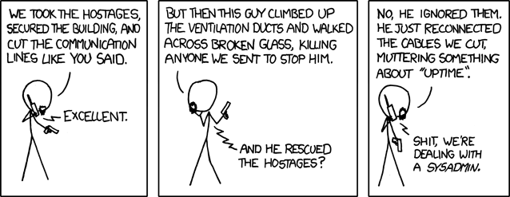

## Capítulo 5:

Quinto episodio, trata sobre el uptime, principal meta u objetivo de un
SysAdmin.

*Imagen cortesía de [xkcd](https://xkcd.com/705/) (CC BY-NC 2.5).*

### Reinicios y uptime

Reinicios, también conocidos como *power cycles*, son algo trivial en un sistema
personal o de escritorio. Sin embargo cuando se trata de cualquier sistema que
presta servicios a terceros, ya sean usuarios u otros servicios o sistemas (por
ejemplo, un servidor de bases de datos que da soporte a un sitio Web y sólo es
accedido por el servidor en cuestión), un reinicio se torna en algo muy delicado.

¿Qué es el bendito "uptime"? El uptime es el tiempo que un sistema estuvo
corriendo de manera ininterrumpida. Generalmente se cuenta como la cantidad de
tiempo transcurrido desde el último inicio, pero también es común verlo en forma
porcentual (especialmente en servicios de *hosting*, soluciones cloud, enlaces,
etc.) como el porcentaje de tiempo que el sistema estuvo disponible en el
transcurso de un mes. Incluso existen [servicios gratuitos para monitorear el uptime](https://www.linuxito.com/gnu-linux/nivel-medio/235-como-monitorear-el-uptime-de-tu-sitio-blog-gratis-gracias-a-siteuptime)
de diferentes tipos de servicios.

Es necesario realizar ciertos chequeos antes de apagar o reiniciar un sistema.

<ul>
<li>¿Hay algún usuario logueado en el sistema?</li>

    <ul>
    <li>En caso de servicios HTTP, <a href="https://www.linuxito.com/gnu-linux/nivel-alto/625-como-saber-si-hay-usuarios-conectados-en-mi-servidor-apache">¿hay actividad en el servidor Web?</a>. Determinar si hay usuarios y sesiones activas, y conexiones establecidas.</li>
    <li>Si se trata de sistemas que proveen servicios a otros servidores, ¿hay conexiones establecidas?</li>
    </ul>

<li>Si se debe realizar una tarea de mantenimiento crítica, como actualizaciones, migraciones o conversiones ¿durante cuánto tiempo es posible mantener el sistema apagado o el servicio inaccesible?</li>

    <ul>
    <li>Es necesario planificar cuidadosamente un periodo de <i>downtime</i> para afectar lo menos posible el servicio, más precisamente a los usuarios del mismo.</li>
    <li>Si no es posible encontrar un período de baja carga o utilización, será necesario coordinar con las áreas responsables, representantes o usuarios del servicio en cuestión para planificar la baja del mismo, en cual caso se deberá notificar el período de interrupción del servicio con su debida anticipación, a través canales de comunicación formales, contando con la autorización de los responsables o representantes del servicio.</li>
    <li>De cualquier forma siempre se debe notificar una baja planificada. Nunca dar de baja un servicio o reiniciar un sistema operativo sin la debida notificación.</li>
    </ul>

<li>¿Existe un <a href="https://www.linuxito.com/nix/711-la-biblia-del-sysadmin-capitulo-2-lo-dificil-seguridad-y-backups">backup</a> para el sistema o servicio involucrado? ¿Es necesario disponer de un backup? En tal caso, ¿se han ejecutado las pruebas de recuperación correspondientes?</li>

    <ul>
    <li>Es de vital importancia verificar los backups y procedimientos de recuperación, especialmente para el caso crítico de <a href="https://www.linuxito.com/gnu-linux/nivel-alto/388-como-migrar-un-servidor-en-produccion-desde-debian-6-a-7">migraciones y conversiones en producción</a>.</li>
    <li>Siempre planificar, probar y documentar este tipo de tareas críticas en <a href="https://www.linuxito.com/programacion/237-el-modelo-de-desarrollo-testing-y-produccion">entornos de desarrollo/testing</a> para evitar cualquier tipo de inconvenientes ni sorpresas desagradables.</li>
    </ul>

<li>Siempre preguntarse si es realmente necesario reiniciar un sistema.</li>

    <ul>
    <li>En la actualidad, las tecnologías de virtualización hacen que sea cada vez menos frecuente la necesidad de un reinicio. Incluso es posible <a href="https://www.linuxito.com/gnu-linux/nivel-alto/714-redimensionar-un-disco-scsi-en-linux-sin-necesidad-de-reinicios">redimensionar un disco rígido sin necesidad de reiniciar el sistema</a>.</li>
    <li>¿Estamos reiniciando el sistema/servicio para tratar de resolver un inconveniente?</li>
         <ul>
         <li>Esta es una estrategia pobre al momento de encarar un problema, y es un comportamiento lamentablemente común en SysAdmins Jr. o con poca experiencia, la cual demuestra falta de conocimiento y metodologías ante colegas, superiores y usuarios por igual.</li>
         <li>Nunca reiniciar un sistema para tratar que vuelva a la vida. Este comportamiento tiene dos consecuencias desastrosas, si tenemos la "suerte" de que el problema se solucione:</li>
             <ul>
             <li>Primero, es probable que nunca sepamos qué ocurrió realmente ni qué fue lo que produjo el error. A veces se presentan circunstancias específicas como <i>deadlocks</i>, conflictos de recursos y otras excepciones que no quedan registradas en un log (o no es posible diagnosticar a través de los mismos). Al mismo tiempo, al reiniciar el servicio/sistema se pierden las condiciones que llevaron a producir el error. Con lo cual será imposible encontrar la solución definitiva para que el problema no vuelva a ocurrir.</li>
             <li>Segundo, hemos perdido una buena oportunidad para aprender algo nuevo. A partir del momento en que resolvemos un problema reiniciando el servicio o sistema, nos convertimos en el robot que reinicia el servicio cuando falla, lo cual es lamentable y patético.</li>
         </ul>
         <li>Por otro lado, si el problema no se soluciona, sólo perdimos tiempo y acumulamos frustración.</li>
         </ul>
    </ul>

<li>Si vamos a reiniciar un sistema operativo, ¿ha sido el <i>bootloader</i> correctamente configurado?</li>

    <ul><li>Especialmente para el caso de <i>upgrades</i> de sistemas operativos Unix/Linux, jamás olvidar actualizar el bootloader y contar con más de un kernel disponible para el inicio.</li></ul>

<li>En caso de fallo al iniciar, ¿existe una forma alternativa para acceder al sistema? Ver el <a href="https://www.linuxito.com/nix/806-la-biblia-del-sysadmin-capitulo-4-administracion-y-acceso-remoto">Capítulo 4</a> al respecto.</li>

<li>Si estamos reiniciando un servicio, ¿hemos comprobado que su configuración sea correcta?</li>

    <ul>
    <li>Es frecuente la necesidad de reiniciar un servicio cuando se cambia su configuración. En tales casos es indispensable verificar la correctitud de la configuración, especialmente su sintaxis, para evitar <i>downtimes</i> y dolores de cabeza. La mayoría de los servicios proveen herramientas para verificar la validez y correcta sintaxis de un archivo de configuración, por ejemplo para Apache y Nginx:</li>
<pre>apache2ctl configtest
service nginx configtest
</pre>
    <li>¿Tenemos una copia de respaldo de la configuración anterior al alcance de la mano?</li>

### Referencias

* [Joe Chung - General SysAdmin Principles &amp; Guidelines](http://rockhopper.monmouth.edu/cs/jchung/cs471/cs_471_-_general_sysadmin_principles)
