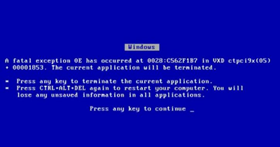

## Capítulo 8: Usuarios y soporte

Este capítulo trata sobre tal vez el problema más complejo que deba enfrentar un
SysAdmin: lidiar con usuarios y resolver sus problemas.

### Usuarios y soporte

* Los usuarios difícilmente describan sus problemas con el nivel de detalle
  necesario para poder resolverlo o que nos permita ayudarlos. Frecuentemente se
  deben mantener conversaciones del siguiente estilo:
    * "Problemas con el sistema":

        ```
        Usuario: Tengo problemas con el sistema.
          Admin: ¿Con cuál sistema?
        Usuario: EL SISTEMA!!!
        ```

        ```
          Admin: ¿Qué problema tiene?
        Usuario: No funciona.
        ```
    
    * "Me saltó un cartel":

        ```
        Usuario: Me saltó un cartel
          Admin: ¿En qué aplicación? ¿Qué decía el cartel?
        Usuario: En el sistema.
        Usuario: No sé, está en inglés, tenía unos números.
        Usuario: Ya lo cerré, no sé qué decía.
        ```
    
    * "Hola, ¿hablo con el sistema?":

        ```
        Usuario: Hola, ¿hablo con el sistema?
          Admin: Err, no, usted está hablando con un ser humano.
        ```
    
    * "Anda lento":

        ```
        Usuario: Anda lento
          Admin: ¿Qué es lo que funciona lento? ¿La aplicación, la red, su computadora?
        Usuario: TODO.
        ```
    
    * Pero el más simpático es el caso típico en el que un usuario lee
      literalmente una *bluescreen of death*:

        ```
        Usuario: Tengo un problema con el sistema.
          Admin: Dígame, ¿qué le sucede?
        Usuario: "A fatal exception 0E has occurred at 0028:C562F1B7 in VXD..."
          Admin: Ok, está bien, deténgase, por favor.
        Usuario: " ctpci9x(05) + 00001853. The current application will be..."
        ```

        

* En el sentido inverso, se debe evitar dar detalles técnicos innecesarios o
  incomprensibles para el usuario al momento de resolver un problema.
    * No "aburrir" al usuario con detalles de bajo nivel que no comprende.
    * Muchas veces no es conveniente que el usuario conozca detalles de la
      implementación de un sistema o aplicación.
        * No sólo desde el punto de vista de la seguridad...
* A veces la tarea de un SysAdmin es mucho más dura cuando tiene que lidiar con
  usuarios impacientes y lamentablemente a veces irrespetuosos.
    * Sin embargo la vocación de servicio de un Admin debe ser preponderante.
    * De lo contrario deberá considerar una carrera en la rama del desarrollo (u
      otra similar) donde sólo deba lidiar con sistemas informáticos y a los
      sumo pares. Por esta razón los desarrolladores son más felices (?)
* Un SysAdmin debe contar con grandes dotaciones de paciencia y jamás de los
  jamases deberá faltar el respeto a ningún usuario (esto más bien debería ser
  una cualidad genérica de todo ser humano supongo).
    * Para el caso de los *DevOps* la tarea suele ser mucho más sencilla, pues
      en general interactúan con desarrolladores más que con usuarios finales.
    * Es mucho más fácil relacionarse con profesionales o usuarios con elevados
      conocimientos técnicos, como lo son los desarrolladores.
    * Resulta difícil "bajar a tierra" conceptos técnicos abstractos, y
      viceversa, al momento de comunicarse con usuarios finales.
        * Sin embargo esta habilidad se puede entrenar y practicar en seminarios
          o charlas, y por qué no también dictando cursos.
* Mesa de ayuda
    * Todos estos problemas se observan más frecuentemente en lo que yo llamo
      "la trinchera": el equipo de mesa de ayuda (*helpdesk*).
    * Si el SysAdmin es responsable por el equipo de *helpdesk* es necesario
      contar con un buen balance entre profesionales más duros (técnicamente
      hablando) y profesionales (o incluso mejor no profesionales) con un perfil
      más social.
    * De esta forma se cuenta con la "herramienta" adecuada para el problema
      indicado:
        * Enviar al perfil técnico si hay un problema con un router inalámbrico.
        * Enviar al perfil social cuando un usuario requiere ayuda con una
          planilla de Excel.
    * Siempre y cuando el SysAdmin pueda participar en los procesos de selección
      y haya recursos suficientes, claro está.
    * Capacitar constantemente al equipo de mesa de ayuda.
        * En este punto nuestra [documentación](capitulo-01.md) es clave.
    * El equipo de mesa de ayuda debe funcionar como *proxy* de los usuarios.
        * Un usuario raramente debería contactar con un SysAdmin y mucho menos
          un desarrollador.
            * Si esto ocurre es porque el equipo de mesa de ayuda no está lo
              suficientemente capacitado, las tareas no están lo suficientemente
              bien documentadas, o simplemente hay un problema de organización.
* Resolver problemas
    * Se debe evitar a toda costa solicitar su contraseña al usuario para
      ingresar al sistema en cuestión y diagnosticar un problema. Esto no sólo
      está prohibido, sino que es un pecado en esta biblia.
        * Si por alguna extraña razón no queda otra alternativa, el usuario se
          verá forzado a cambiar su contraseña.
        * Sin embargo, una vez más, esto debe ocurrir sólo en casos de vida o
          muerte.
        * No es conveniente conocer una contraseña de un usuario.
            * Muchas veces los usuarios utilizan la misa contraseña en todos los
              sistemas, como por ejemplo su *home banking*. Por ende blanquear
              su contraseña no es de gran ayuda.
            * No queremos "quedar pegados" con futuros incidentes de seguridad.
    * En los sistemas de la familia Unix, siempre se puede recurrir a
      herramientas como `su`, `sudo` o `doas` para cambiar de usuario o ejecutar
      programas a nombre de otro.
    * A su vez se debe contar con usuarios de prueba en todas las aplicaciones
      Web bajo nuestra órbita.
    * Siempre se puede pedir una *screenshot* o al menos una captura con el
      móvil.
        * Este suele ser el recurso más adecuado para resolver un problema, en
          conjunto con la información recogida desde los logs.
        * Y hablando de logs... Los logs del sistema y aplicaciones deben ser
          siempre el primer lugar donde acudir en caso de problemas no
          reportados por usuarios.
            * Especialmente en el caso de los sistemas operativos de la familia
              Unix, un SysAdmin debe conocer las ubicaciones de todos los
              archivos de log de todas las aplicaciones y el sistema.
            * Evitar logs en formatos que no sean de texto plano y aberraciones
              como `journald`.
            * En otros sistemas operativos (notablemente Windows) no hay
              escapatoria a los logs en formato binario (se debe recurrir a
              herramientas nefastas como Event Viewer).
* *"Eat your own dogfood"*
    * El término "eat your own dogfood", o simplemente *[dogfooding](https://en.wikipedia.org/wiki/Eating_your_own_dog_food)*,
      no tiene una traducción directa o refrán compatible en el idioma español,
      y se utiliza en este caso para indicar que debemos utilizar lo que les
      damos a los usuarios. Es decir, no debemos utilizar Windows 10 en nuestras
      estaciones de trabajo si a los usuarios les damos Windows 8.1, por poner
      un ejemplo.
    * Utilizar el mismo entorno, mismas herramientas y mismas máquinas que les
      damos a nuestros usuarios, en las mismas redes. Esto tiene varias
      ventajas:
        * Podremos identificar y resolver muchos problemas antes de que ocurran
          (al menos antes de que les ocurra a los usuarios).
        * Estar familiarizados con las aplicaciones y entorno de los usuarios
          nos permite ayudarlos de manera más eficaz y eficiente.
        * Estar familiarizados con las aplicaciones y entorno de los usuarios
          nos permite identificar más rápidamente la causa o raíz de un
          problema.
        * Al utilizar las mismas herramientas podremos conocer con exactitud sus
          ventajas y limitaciones.
    * Ser un usuario. Utilizar herramientas de usuario.
        * No se puede llegar a ser un administrador de sistemas Unix sin ser
          antes un usuario de sistemas Unix.
        * Este principio aplica a todo sistema informático.
        * Utilizar una distribución GNU/Linux en nuestra estación de trabajo y
          darles Windows a los usuarios sólo va a dificultar nuestra tarea de
          soporte.
                * Como mínimo se debe contar con una máquina virtual corriendo
                  el mismo entorno que nuestros usuarios.
    * Preocuparse por la usabilidad del entorno de sistema operativo de los
      usuarios.
        * Esto tiene el beneficio extra de reducir el soporte y dolores de
          cabeza.
        * Utilizar una configuración sensible para los perfiles de las shells.
        * Recurrir a `[sudo](https://www.linuxito.com/seguridad/464-como-permitir-que-un-usuario-pueda-ejecutar-como-root-solo-un-comando-especifico-utilizando-sudo)`
          para permitir cierto tipo de operaciones privilegiadas.
            * Sin comprometer la seguridad de los sistemas.
        * Utilizar una interfaz de usuario por defecto (gestor de ventanas o
          escritorio) familiar e intuitivo.
            * Encontrar un balance correcto entre facilidad de uso para el
              usuario, eficiencia y simplicidad de administración.
            * No siempre es fácil encontrar un balance entre las dos primeras,
        * Proveer a los usuarios con las herramientas necesarias para llevar a
          cabo sus tareas. Contar con herramientas ofimáticas adecuadas.
        * Estar abierto a las sugerencias de los usuarios en cuanto a
          aplicaciones, restricciones y limitaciones, manteniendo siempre el
          foco en la seguridad, escalabilidad y mantenibilidad de toda solución
          propuesta.
            * De nada sirve una aplicación que ningún usuario utilizada, por más
              buena que sea.
            * No es de gran ayuda proveer una solución de almacenamiento en la
              nube si la cuota de espacio ofrecida no es suficiente para la
              mayoría de los usuarios.
            * Siempre es preferible proveer una aplicación instalada y
              configurada correctamente a que los usuarios "se las rebusquen por
              sus propios medios".
                * Evitar que los usuarios recurran a software "portable".
                * Evitar que los usuarios compartan archivos a través de, o
                  utilicen como sistema de backup a, medios removibles.
                * Sólo por citar un par de ejemplos...
* Educar y entrenar a los usuarios
    * ¿Existe documentación de alto nivel o una página Web de soporte para los
      usuarios?
    * Planificar capacitaciones de uso general y de aplicaciones específicas
      para incentivar a los usuarios.
    * Siempre es un buen momento para promover el uso de la herramienta adecuada
      para cada tarea.
    * Es una buena idea planificar seminarios y charlas, especialmente para
      concientizar acerca de la seguridad de la información y buen uso de las
      herramientas provistas.
* Nunca subestimar a los usuarios
    * No asumir que los usuarios no están lo suficientemente
      formados/capacitados o que desconocen o no son conscientes de las últimas
      brechas de seguridad encontradas.
    * El atacante más peligroso y más frecuente es el atacante interno.
    * Jamás caer en la mentalidad del "nunca va a pasar aquí".

### Referencias

* [Joe Chung - General SysAdmin Principles & Guidelines](http://rockhopper.monmouth.edu/cs/jchung/cs471/cs_471_-_general_sysadmin_principles)
